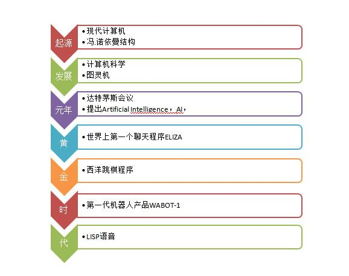

# What is AI?

## AI发展史  

AI发展史可以追溯到计算机诞生时代。  

在经历过二十年黄金时代的发展后，人们开始意识到计算类的功能可以被机器很好的完成。  
但是，对于感知类的功能却很难达到模拟人类的要求。  
人们对人工智能的理解也从幻想中的智能转变到重视人工技术。  

Thomas J. Sargent ：人工智能是由机器和人分饰两角的，非常有趣。  

现在人们对于人工智能的期待，不再像科幻电影里那样不切实际。  
技术人员意识到当下可以实现的AI技术是基于人的“思考”，让机器来实施，  

AI应该着眼于解放生产力而不是“完全替换人类”。  

